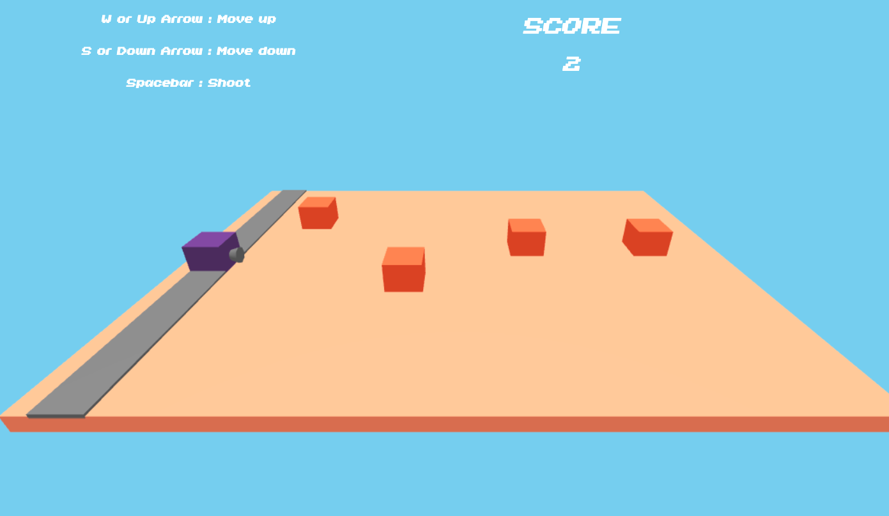

# Shoot-Them-Boxes
3D shooter game made with Three.js, Javascript, HTML and CSS. 

## Dependency
Three.js library.

You can download it [here](https://threejs.org/)

Add it to the ShootThemBoxes folder.

When unzipped, make sure the folder name is **three.js-master**.

## Running the game
Naviguate to the ShootThemBoxes directory.

A server is needed to run the "ShootThemBoxes.html" file.

Example with Node.js http-server as a local server, npm has to be pre-installed.

To install:
`npm install http-server -g` The -g option is to install globally, can be omitted.

To run:
`http-server`

By default, Node.js will use **localhost:8080**

Enjoy the game by typing http://localhost:8080/ in your browser!

## How to play
Shoot the boxes before they arrive at the end of the floor!

W or Up arrow : Move up  
S or Down arrow : Move down  
Spacebar : Shoot

## Images

